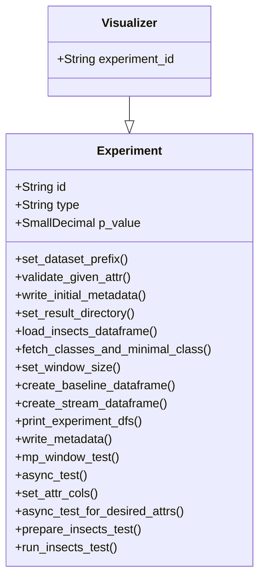

# Entities of the experiments

```mermaid
classDiagram

Visualizer --|> Experiment

class Experiment{
    +String id
    +String type
    +SmallDecimal p_value

    +set_dataset_prefix()
    +validate_given_attr()
    +write_initial_metadata()
    +set_result_directory()
    +load_insects_dataframe()
    +fetch_classes_and_minimal_class()
    +set_window_size()
    +create_baseline_dataframe()
    +create_stream_dataframe()
    +print_experiment_dfs()
    +write_metadata()
    +mp_window_test()
    +async_test()
    +set_attr_cols()
    +async_test_for_desired_attrs()
    +prepare_insects_test()
    +run_insects_test()
}

class Visualizer{
    +String experiment_id
}


```

